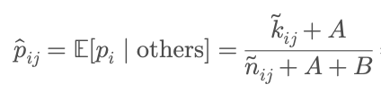
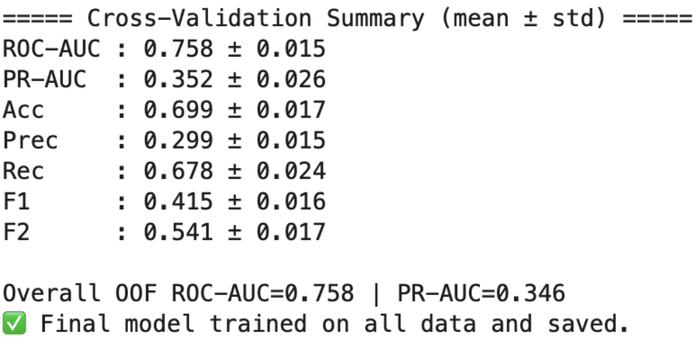
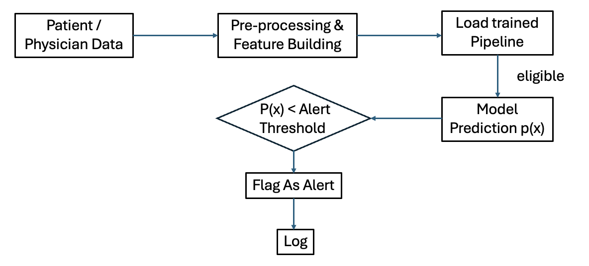

# 🧬 DiseaseX — Treatment Propensity & EMR Alert Simulation

## Overview

This project builds a complete, modular pipeline to predict which patients are less likely to be treated with Drug A for Disease X and to simulate EMR alerts that can guide physician follow-up.
It covers data cleaning → feature engineering → machine-learning modeling → explainability → deployment via FastAPI + Docker.

⸻

## Project Overview

This project follows the full data-to-deployment pipeline:

Steps Description
1. Data Cleaning
2. Feature Engineering
3. Modeling & Evaluation
4. EMR Alart Simulation
5. API Deployment (FastAPI)
6. Containerization
7. Software Architecture
8. Version Control

⸻

🧩 Project Structure

---
## Step 0 - EDA (Evaluate data and form actions to be taken)
Scripts in `notebooks/0_EDA.ipynb`

## 🧹 Step 1 – Data Cleaning
First clean data in 3 tables independently before join.
Scripts in `notebooks/1a_Preprocessing_clean.ipynb` normalize column names, unify string formats, and enforce correct types. `notebooks/1b_EDA_post_clean.ipynb` verifies the clearning.

Each of the three source tables (the Facts and two dimension tables) is cleaned independently before joining.
Scripts in notebooks/1a_Preprocessing_clean.ipynb normalize column names, unify string formats, and enforce correct data types, while notebooks/1b_EDA_post_clean.ipynb verifies and validates the cleaning results.

**Key actions**

| Step | Description | Impact |
|------|--------------|--------|
| **1. Drop duplicates** | Removed exact duplicate rows from `fact_txn` | Ensures one record per event |
| **2. Parse dates** | Converted `TXN_DT` to datetime (`pd.to_datetime`) with coercion | Enables temporal analysis |
| **3. Normalize IDs** | Converted `PATIENT_ID` and `PHYSICIAN_ID` to consistent string or Int64 formats (stripped trailing `.0`, whitespace, “None”) | Prevents join mismatches |
| **4. Text normalization** | Lowercased and trimmed descriptive columns (`TXN_TYPE`, `TXN_DESC`, `TXN_LOCATION_TYPE`, etc.) | Avoids category fragmentation |
| **5. State normalization** | Converted physician `STATE` to uppercase and mapped full names → USPS abbreviations (e.g., “California” → “CA”) | Standardizes geolocation features |
| **6. Gender cleanup** | Standardized to lower case; invalid set to unknown| Harmonizes patient attributes |
| **7. TXN_TYPE filtering** | Restricted to allowed values `{conditions, symptoms, contraindications, treatments}` | Removes irrelevant transactions |
| **8. Summary reporting** | Printed counts of dropped duplicates, null ratios, and normalized unique values | Ensures transparent QA |

**Output:**
Clean versions of all three tables:

1b_EDA_post_clean to check and verify the results of 1a.

---

## 🧠 Step 2 – Feature Engineering
Each row in `model_table.csv` corresponds to a **unique patient_id**.

---

| **Category** | **Features** | **Description** | **Rationale** |
|---------------|--------------|------------------|----------------|
| **Demographics** | `PATIENT_AGE`, `PATIENT_GENDER`, `IS_AGE65PLUS`, `AGE_GE_12` | Derived from birth year and diagnosis or symptom onset | Captures demographic eligibility   and age-related treatment bias |
| **Clinical Risk** | `NUM_CONDITIONS`, `HAS_UNDERLYING`, `HIGH_RISK`, `ELIGIBLE` | Encodes comorbidity and eligibility logic | Reflects patient-level risk factors   influencing treatment decisions |
| **Contraindications** | `CONTRAINDICATION_LEVEL` | Ordinal feature (0–3) summarizing severity of contraindications | Represents safety constraints   affecting physician decisions |
| **Timing** | `DAYS_SYMPTOM_TO_DX` | Days between first symptom onset and Disease X diagnosis | Quantifies diagnostic delay   — a strong predictor of treatment likelihood |
| **Physician & Location** | `PHYSICIAN_TYPE`, `PHYSICIAN_STATE`, `LOCATION_TYPE`, `PHYS_TREAT_RATE` | Context of care and physician prescribing propensity | Models behavioral and geographical   differences in treatment patterns |
| **Target** | `TARGET` | Binary outcome — whether the patient received Drug A | Serves as the supervised learning   label for model training |

New (non-trivial) features are:
- `DAYS_SYMPTOM_TO_DX`
- `PHYS_TREAT_RATE`
- `CONTRAINDICATION_LEVEL`
- `HIGH_RISK`
- `ELIGIBLE`

The first two features — DAYS_SYMPTOM_TO_DX and PHYS_TREAT_RATE — are the most innovative, as they capture temporal and behavioral dynamics that align with real-world, data-driven decision processes.
A Bayesian smoothing algorithm was specifically designed for PHYS_TREAT_RATE, since standard Laplacian smoothing introduced excessive noise when data were sparse (most physicians had only 0–1 diagnosed Disease X patient, and treated cases were even fewer).
However, this approach did not perform as well as expected, likely due to a high proportion of missing or extremely limited physician-level data.

### 📄 Data Dictionary

All features in `data/processed/model_table.csv` are derived from the cleaned EMR tables (`fact_txn`, `dim_patient`, and `dim_physician`).

| **Column** | **Description** |
|-------------|-----------------|
| `PATIENT_ID` | Unique patient identifier |
| `PATIENT_AGE` | Age at time of Disease X diagnosis |
| `PATIENT_GENDER` | Patient gender (`m` / `f`) |
| `NUM_CONDITIONS` | Number of underlying conditions |
| `HAS_UNDERLYING` | Binary flag (1 = has high-risk comorbidities) |
| `IS_AGE65PLUS` | Binary flag (1 = patient ≥ 65 years) |
| `AGE_GE_12` | Binary flag (1 = patient ≥ 12 years) |
| `HIGH_RISK` | Composite flag (`IS_AGE65PLUS` or `HAS_UNDERLYING`) |
| `ELIGIBLE` | Clinical eligibility (`AGE_GE_12` and `HIGH_RISK`) |
| `CONTRAINDICATION_LEVEL` | Ordinal severity (0–3) of contraindications |
| `DAYS_SYMPTOM_TO_DX` | Days between symptom onset and diagnosis |
| `PHYSICIAN_ID` | Identifier of diagnosing physician |
| `PHYSICIAN_TYPE` | Physician specialty |
| `PHYSICIAN_STATE` | Two-letter state abbreviation |
| `LOCATION_TYPE` | Encounter location (e.g., `office`, `telehealth`, `hospital`) |
| `PHYS_TREAT_RATE` | Physician’s historical treatment rate (Bayesian LOO estimate) |
| `TARGET` | Label: 1 = treated with Drug A, 0 = untreated |

---

### 📂 Data File

📄 [**model_table.csv**](data/processed/model_table.csv)

---

## 🤖 Step 3 – Modeling & Evaluation

Four types of models were evaluated. Logistic Regression was used as a sanity check and performed surprisingly well, providing a strong baseline. LightGBM delivered reasonable performance with faster training speed than XGBoost, though its overall accuracy was slightly lower. XGBoost achieved the best overall performance (especially F2). Deep learning methods were not applied, as their black-box nature makes them difficult to interpret — a critical limitation in medical applications where explainability is essential.

| Model | ROC-AUC | PR-AUC | Acc | Prec | Rec | F1 | F2 |
|:------|:--------:|:------:|:---:|:----:|:---:|:--:|:--:|
| Logistic Regression | 0.75 | 0.33 | 0.68 | 0.28 | 0.63 | 0.41 | 0.53 |
| Random Forest | 0.73 | 0.34 | 0.67 | 0.31 | 0.63 | 0.41 | 0.52 |
| LightGBM | 0.74 | 0.34 | 0.68 | 0.28 | 0.67 | 0.41 | 0.53 |
| **XGBoost (final)** | **0.758** | **0.352** | **0.699** | **0.299** | **0.678** | **0.415** | **0.541** |

### Cross-validation (CV) strategy

The model was evaluated using a 5×2 cross-validation (CV) strategy — that is, 5 folds repeated twice with different random splits to ensure stable and unbiased performance estimation.
This approach provides both variance estimation and robustness across different train/test partitions.

### Hyperparameter Optimization

The model’s parameters were tuned using randomized search over a compact but effective search space. Each trial sampled different values for learning rate, tree depth, regularization, and sampling ratios — balancing exploration and efficiency.

param_dist = {
    "learning_rate": uniform(0.02, 0.02),   # 0.02–0.04
    "max_depth": randint(3, 6),              # 3–5
    "min_child_weight": randint(1, 4),       # 1–3
    "reg_lambda": uniform(1.5, 1.5),         # 1.5–3.0
    "reg_alpha": uniform(0.5, 0.5),          # 0.5–1.0
    "gamma": uniform(0.0, 0.1),              # pruning strength
    "subsample": uniform(0.75, 0.25),        # 0.75–1.0
    "colsample_bytree": uniform(0.75, 0.25)  # 0.75–1.0
}

Search method:
	•	Used RandomizedSearchCV with 5×2 cross-validation, testing 30 random combinations.
	•	Evaluated each trial by ROC-AUC to select the most stable, high-recall configuration.
	•	The best parameters were then retrained on the full training set for final deployment.

Goal: achieve high recall for under-treated patients while preventing overfitting.

## 🏆 Final Model: XGBoost (`model_minimal.joblib`)
Chosen for its strong balance of **accuracy, recall, and interpretability**.
- Robust to mixed categorical / numeric inputs via one-hot encoding
- Handles **non-linear effects** and **imbalanced classes** using `scale_pos_weight`
- highest AUC-ROC, PR-AUC and especially F2

## 📈 Model Insights (SHAP Feature Contributions)
**Top positive influencers (increase treatment likelihood):**
- **`PATIENT_AGE`** ↑ — older patients more likely to receive Drug A (<80)
- **`NUM_CONDITIONS`** ↑ — more comorbidities → higher likelihood
- **`LOCATION_TYPE = office`** — in-person visits strongly associated with treatment
- **`PHYSICIAN_TYPE = family / internal medicine`** — higher prescribing tendency

**Top negative influencers (reduce treatment likelihood):**
- **`LOCATION_TYPE = telehealth` or `independent laboratory`** — lower likelihood of treatment initiation
- **`younger patients` (< 40 yrs)** — less likely to be treated despite eligibility
- **`high contraindication levels`** — safety constraints decreasing probability

---

# 🩺 Step 4 – EMR Alert Simulation
Patients ranked by **predicted P(TREATED)** (ascending).
Alerts target **least likely to be treated**.

| Coverage | Recall (untreated) | Precision (true untreated) | F2 |
|-----------|-------------------|-----------------------------|----|
| 60 % | 0.72 | 0.95 | 0.75 |
| 70 % | 0.81 | 0.93 | 0.83 |
| 90 % | 0.96 | 0.85 | 0.94 |

➡ Recommended coverage **60 – 70 %** to balance recall vs workload.

---

## 🚀 Step 5 – API Deployment (FastAPI + Docker)

## ⚙️ Setup and Local Run

###  Create a virtual environment

python -m venv .venv_diseasex
source .venv_diseasex/bin/activate
pip install -r requirements.txt

### Train the model

python -m training.train --model xgb

Outputs:
	•	artifacts/final_pipe.joblib — trained model
	•	artifacts/metrics_baseline.json — evaluation metrics

⸻

### 🧠 Model Details

| **Component** | **Description** |
|----------------|-----------------|
| **Algorithm** | XGBoost / Random Forest / Logistic Regression (with balanced class weights) |
| **Core Features** | `DISEASEX_DT`, `PATIENT_AGE`, `PATIENT_GENDER`, `NUM_CONDITIONS`, `PHYSICIAN_TYPE`, `PHYSICIAN_STATE`, `LOCATION_TYPE` |
| **Extended Features** | `PHYS_TREAT_RATE` (physician propensity), `DAYS_SYMPTOM_TO_DX` (onset-to-diagnosis lag), and eligibility flags |
| **Target** | `TARGET = 1` if patient received Drug A; else 0 |
| **Metrics (5×2 CV)** | **ROC-AUC ≈ 0.75**, **PR-AUC ≈ 0.34**, **F2 ≈ 0.54**  *(favoring recall for under-treated patients)* |

⸻

🧩 Run the FastAPI Service

1. Start API locally

uvicorn app.main:app --reload --port 8000

2. Example request

Endpoint: POST /predict

Input JSON:

{
  "DISEASEX_DT": "2022-06-14",
  "PATIENT_AGE": 58,
  "PATIENT_GENDER": "f",
  "NUM_CONDITIONS": 2,
  "PHYSICIAN_TYPE": "family medicine",
  "PHYSICIAN_STATE": "TX",
  "LOCATION_TYPE": "office",
  "threshold": 0.60
}

Response:

{
  "P_TREATED": 0.7726,
  "P_UNTREATED": 0.2274,
  "threshold": 0.40,
  "message": "✅ Likely to be treated"
}

⸻

## 🚀 Step 6 Containerization: Docker Deployment

### Build the image

docker build -t diseasex-alert .

### Run the container

docker run --rm -p 8000:8000 diseasex-alert

### Test via curl

curl -s http://localhost:8000/predict \
  -H "Content-Type: application/json" \
  -d '{
    "DISEASEX_DT":"2024-05-10",
    "PATIENT_AGE":65,
    "PATIENT_GENDER":"M",
    "NUM_CONDITIONS":2,
    "PHYSICIAN_TYPE":"family medicine",
    "PHYSICIAN_STATE":"TX",
    "LOCATION_TYPE":"hospital",
    "threshold":0.45
  }'

  Expected Response: {"P_TREATED":0.68,"P_UNTREATED":0.32,"threshold":0.45,"message":"✅ Likely to be treated"}

⸻

🧪 Running Tests

pytest -q

Expected Output

5 passed, 0 failed

⸻

## 🚀 Step 7  Software Architecture

### 🧩 Components Overview

| **Layer** | **Description** |
|------------|-----------------|
| **Training Layer** | Reads and cleans EMR data, engineers features, builds `model_table.csv`, and trains the ML model. |
| **Model Artifact** | Trained model serialized with `joblib` and stored under `artifacts/` for inference reuse. |
| **Inference Layer** | Lightweight FastAPI REST service that loads the model and predicts treatment likelihood for new patients. |
| **Alert Layer** | Applies thresholds to flag patients with low predicted treatment probability (potential under-treatment). |
| **Containerization** | Dockerized deployment ensuring full reproducibility and environment portability. |

Figure: End-to-end inference and alert decision workflow.
Patient and physician data are first preprocessed to build model-ready features. The trained pipeline (.joblib) computes the treatment probability p(x) for eligible patients. If p(x) falls below the configurable alert threshold, the system flags an under-treatment alert and logs the decision for auditability.

---

### ⚙️ Error Handling & Logging

- Central FastAPI middleware logs every API request with timestamps.
- All inference steps are wrapped in `try/except` blocks to gracefully handle missing or malformed data.
- Logging includes both request payloads and model predictions for traceability.
- Logs are automatically written to:
  📄 `artifacts/api_requests.log`

⸻

## 🧭 Step 8 Version Control Strategy

| **Element** | **Strategy** |
|--------------|--------------|
| **Code** | Follow a clear Git branching model: `main` (stable), `dev` (active development), and `feature/*` (per-feature branches). |
| **Model Artifacts** | Versioned under `artifacts/` (e.g., `model_minimal_v1.joblib`), tagged with date or commit hash for reproducibility. |
| **Data** | Maintain versioned processed data (e.g., `data/processed/model_table_v1.csv`) while ensuring schema consistency. |
| **Merging** | Use Pull Requests (PRs) for all merges; apply *squash commits* to keep history concise and meaningful. |
| **Conflict Resolution** | Rebase local changes onto `main` before merging and resolve conflicts using VSCode merge tools or CLI (e.g., `git mergetool`). |

⸻

### 🧩 Design Choices

- **XGBoost & Random Forest Models:**
  Chosen for strong performance on structured clinical data, handling mixed feature types and class imbalance effectively.

- **FastAPI Framework:**
  Asynchronous, production-grade REST API with automatic OpenAPI docs (`/docs`) and native async I/O for high throughput.

- **Dockerized Environment:**
  Guarantees consistent runtime across local, staging, and cloud deployments with minimal configuration drift.

- **Modular Architecture:**
  Training, inference, and API layers are decoupled, improving maintainability and enabling independent updates or scaling.

- **Configurable Alert Threshold:**
  Sensitivity threshold for patient alerts can be adjusted dynamically through the environment variable `ALERT_THRESHOLD`.

---

### ⚙️ Scalability Notes

- **Batch & Streaming Inference:**
  Supports batch predictions or can be extended to real-time streaming (e.g., Kafka, AWS Kinesis) for hospital-scale data flow.

- **Model Registry Integration:**
  Models and metrics can be tracked and versioned via MLflow or DVC for traceability and rollback.

- **Horizontal API Scaling:**
  Containerized FastAPI service can be deployed under load balancers or Kubernetes for high-concurrency environments.

- **GPU Acceleration:**
  XGBoost automatically leverages NVIDIA GPUs (`tree_method='gpu_hist'`) when available, reducing training time on large EMR datasets.

- **Monitoring & Drift Detection:**
  API logs (`artifacts/api_requests.log`) can be integrated with Prometheus/Grafana or ELK Stack to track performance and detect model drift.

---

### 🔁 MLOps Integration

- **CI/CD Pipeline:**
  Continuous integration (via GitHub Actions or GitLab CI) automatically tests, builds, and deploys new model versions.

- **Automated Retraining:**
  Scheduled retraining workflows (e.g., Airflow or Prefect) refresh the model as new EMR data is ingested, maintaining predictive stability.

- **Model Validation Gates:**
  Each new version must pass ROC-AUC and F2 score thresholds before deployment, preventing performance regression.

- **Artifact Versioning:**
  Models, metrics, and preprocessing schemas are version-controlled, ensuring full lineage and rollback capability.

- **Environment Parity:**
  Docker and `requirements.txt` ensure identical configurations across dev, staging, and production environments.

---

⸻

## 🏁 Deliverables Summary

✅ model_table.csv included under data/processed/
✅ ML model saved as artifacts/model_minimal.joblib
✅ REST API (FastAPI) running locally or in Docker
✅ Complete README, test coverage, and reproducible environment

⸻

📜 License

This project is submitted as part of the Disease X Treatment Alert Coding Exercise for internal evaluation.
All patient data are synthetic and non-identifiable.
